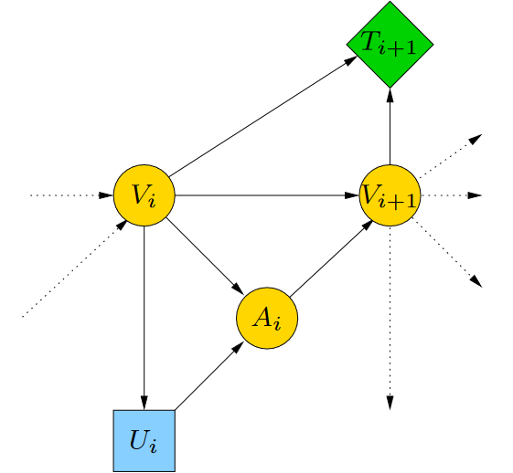

```{r setup, include=FALSE}
knitr::opts_chunk$set(echo = TRUE)
```

This supplementary material provides detailed implementation steps for the influence diagrams and speed profile optimization, as discussed in the following papers:

* *Kratochvíl Václav, Vomlel Jiří*:  **Influence Diagrams for the Optimization of a Vehicle Speed Profile**, *Proceedings of the Twelfth UAI Bayesian Modeling Applications Workshop (BMAW 2015)*, p. 44-53 , Eds: Agosta J. M., Carvalho R. N., 2016. [ArXiv preprint arXiv:1511.09300](https://arxiv.org/pdf/1511.09300)

* *Kratochvíl Václav, Vomlel Jiří*:  **Influence Diagrams for Speed Profile Optimization**, *International Journal of Approximate Reasoning*, Vol. 88, 1 (2017), pp. 567-586. [DOI: 10.1016/j.ijar.2016.11.018](https://doi.org/10.1016/j.ijar.2016.11.018)

**This implementation closely follows the first paper, where each part of the influence diagram contains two cliques.**

## Introduction: A Formula 1 Race Car at Silverstone
This example demonstrates the use of influence diagrams to solve a computational problem involving a Formula 1 race car driving around the *Silverstone circuit*. The goal is to minimize the time the car spends on the track, though the same approach could be adapted to other objectives, such as fuel efficiency in civilian applications.

The Silverstone circuit is discretized into segments of fixed lengths (e.g., 1m, 5m, 10m, 20m). For each segment, we have data on the radius of the turn. The key challenge is to determine the maximum permissible speed at each point based on the radius of the turn and the maximum allowable centrifugal force, which depends on the car's specifications.

### Problem Formulation

- **Track Data**: The circuit data file contains the discretized track segments, each storing the radius of the turn.
- **Constraints**: The radius of the turn, combined with the maximum centrifugal force (which is determined by the car's specifications), imposes an upper limit on the speed for each segment.
- **Objective**: The objective is to minimize the lap time by adjusting the speed at each segment to the highest value permitted by the car’s specifications and track conditions.


## Influence Diagrams for Decision-Making

To solve this problem, we can model it using influence diagrams, a graphical representation of decision-making processes under uncertainty. Influence diagrams are ideal for modeling the dynamic decision-making involved in optimizing the car's speed on the track because they allow us to represent the relationships between different variables (such as speed, radius, centrifugal force, and time) and how they influence the outcome (time spent on the track).

### We use the influence diagram to:

* Represent the Track Data: Each point on the track is a node where we need to decide the optimal speed.
* Account for Constraints: At each segment, the speed is constrained by the car’s maximum allowed centrifugal force and the radius of the turn.
* Optimize the Objective: The decision nodes in the diagram represent the choice of speed at each point, aiming to minimize the overall time.

We divide the vehicle path into *n* segments, each of the same length *s*. In each segment $[i, i + 1]$, where $i \in \{0, . . . , n − 1\}$, there are three random variables: the initial velocity $V_i$, acceleration $A_i$, and final velocity $V_{i+1}$. In addition, there is one decision variable $U_i$ and one utility potential $T_i$. 

The influence diagram corresponding to a single path segment is shown below. In our experiments, the influence diagram consisted of 1010 parts, each representing a 5-meter segment.



In the following code, the decision variable is called **pedal**. It can take both positive and negative values. Negative values correspond to braking, while positive values represent throttle. This is possible because you never perform both actions simultaneously — you either want to accelerate or decelerate.

## Physics

This section simulates the vehicle dynamics for a Formula 1 race car, focusing on speed, acceleration, and utility. Below is a summary of the main functions:

- The `Speed` function computes the speed at a given distance based on initial speed, acceleration, and limits.
- The `Acceleration` function models the car’s acceleration, taking into account slope, throttle, and braking, with parameters specific to Formula 1.
- The `Time` function calculates the time required to travel a given distance based on initial speed and acceleration.
- Finally, the `Utility.f` function balances fuel consumption and time, with the flexibility to prioritize time minimization by adjusting the `alpha` parameter.
```{r physics}
#' Next Point Speed
#' 
#' Computes the speed at a distance \eqn{s} with acceleration \eqn{a} (in m/s²) and initial speed \eqn{v} (in km/h), while considering the maximum and minimum allowed speeds.
#'
#' @param a Acceleration \eqn{ms^{-2}}
#' @param v Speed \eqn{kmh^{-1}}
#' @param s Distance \eqn{m}
#'
#' @return Speed \eqn{kmh^{-1}}
Speed = function(a, v, s = 1) {
  v <- suppressWarnings(3.6 * sqrt((v / 3.6)^2 + 2 * s * a))
  # If we never reach the next point, assume the speed there is 0
  v[is.nan(v)] <- 0
  return(v)
}


#' Acceleration
#'
#' Computes acceleration based on the initial speed \eqn{v} (in km/h), slope \eqn{d} (in %), and pedal position \eqn{p}. The pedal values range as follows:
#' - p in (-100, 0): braking (negative values)
#' - p = 0: neutral (coasting)
#' - p in (0, 100): throttle (positive values)
#' 
#' @param v Initial speed in km/h
#' @param d Slope in percent
#' @param p Pedal position: -100 (full brake) to 100 (full throttle)
#'
#' @return Acceleration 
Acceleration = function(v, d = 0, p) {
  b = 0  # braking factor
  if (p < 0) {  # braking is applied
    b = -p
    p = 0
  }
  
  # Formula 1 specific acceleration calculation
  return(-9.81 * d + 0.16 * p - 0.18 * b - 0.0021 * (v / 3.6)^2) 
}

  
#' Time
#' 
#' Computes the time required for the vehicle to travel a distance \eqn{s} with an initial velocity \eqn{v} and constant acceleration \eqn{a}.
#'
#' @param v Initial speed in km/h
#' @param a Constant acceleration in m/s²
#' @param s Distance to travel in meters
#'
#' @return Time in seconds
Time = function(v, a, s = 1) {
  v2 = Speed(a = a, v = v, s = s)  # Compute speed at next point
  t <- (2 * s) * 3.6 / (v + v2)    # Compute time based on distance and speed
  return(t)
}


#' Utility Function
#' 
#' Computes the utility function, balancing between fuel consumption and time spent on the road. For Formula 1, set \eqn{alpha = 1} to minimize time only, ignoring fuel consumption.
#'
#' @param p Throttle value (related to fuel consumption)
#' @param t Time spent driving (in seconds)
#' @param alpha Weighting factor for time vs. fuel consumption; set \eqn{alpha = 1} to prioritize time only.
#'
#' @return Utility score
Utility.f = function(p, t, alpha = 1) {
  # In case of braking, consider idle fuel consumption
  return(((1 - alpha) * (0.0959438787367234 + 0.000787841779958095 * (p^2)) + alpha) * t)
}

```

## Settings
This block of code handles the discretization of key variables, including speed, acceleration, throttle, and other parameters. The simulation of track and vehicle dynamics is performed at specific intervals, defined by the number of discretization points. 

By discretizing all data points, this approach ensures efficient computation while maintaining accuracy in the vehicle's performance modeling. It allows for a manageable and detailed representation of the problem, with consistent resolution across all variables.

```{r settings}
# Minimum and maximum speed considered. Minimum speed must be positive.
minSpeed = 18
maxSpeed = 360

# Acceleration limits (max braking, max acceleration)
minAccel = -34
maxAccel = 16

# Number of discretization points for:
vDiscr = 400  # speed
aDiscr = 100  # acceleration
pDiscr = 100  # throttle

# Priority of time vs. fuel consumption
timePriority = 1  # 1 - we do not care about fuel in Formula 1 (focus on time)
```

## Track

The track is discretized at intervals of x meters, and x is included in the file name. The data is stored in a standard CSV file, which contains the following columns:

- *lap.distance*: Distance from the start (in meters)
- *r*: Turning radius at a specific point
- *vmax*: Maximum allowed speed at that point (e.g., due to traffic signs)
- *slope*: Terrain slope at that point (in Formula 1, this is always 0)
- *vmin*: Minimum allowed speed at that point (e.g., due to traffic signs)
- *vdop*: Maximum speed at a given point based on the turning radius and the resulting centrifugal acceleration (0.3G for a personal car, 3G for Formula 1)

### Download track files
- [Siverstone  1m, 5m, 10m, and 20m discretization](../Tracks.zip)
```{r load track}
# Load Silverstone circuit parameters
trackDiskr = 5  # track discretization in meters
track = as.matrix(read.csv(paste("F1Track", trackDiskr, "m.csv", sep = ""), sep = ";", dec = ","))
```

## Set Up Discretization

This section handles the discretization of key variables: speed, acceleration, and throttle.

```{r}
# Speed discretization
vGap = round((maxSpeed - minSpeed) / vDiscr, 1)
speeds = seq(from = minSpeed, to = maxSpeed, by = vGap)

# Acceleration discretization
aGap = round((maxAccel - minAccel) / aDiscr, 2)
accel = seq(from = minAccel, to = maxAccel, by = aGap)

# Throttle discretization (negative values for braking, positive values for throttle)
pGap = round(200 / pDiscr, digits = 2)
pedal = ((-100 %/% pGap):(100 %/% pGap)) * pGap
```


## Probability Potential: $\Phi_V$

This part defines the potential for speed ($\Phi_V$), using zero compression.

```{r}
# Initialize probability potential Φ_V with zero compression
Phi_V = list(id = array(0, dim = c(length(speeds), length(accel))),
             p = array(0, dim = c(length(speeds), length(accel))))

# Φ_V remains constant throughout the computation
for (ia in 1:length(accel)) {
  # Calculate the speed at the next point
  v = Speed(a = accel[ia], v = speeds, s = trackDiskr)
  
  # Fit speed into the discretization table
  iv = (v - minSpeed) %/% vGap + 1
  
  # Calculate the probability of hitting the exact point
  Phi_V$p[, ia] = 1 - ((v - minSpeed) %% vGap) / vGap
  
  # If the speed is outside the discretization interval, use the border values
  Phi_V$p[iv < 1 | iv >= length(speeds), ia] <- 1
  iv = replace(iv, iv < 1, 1)
  iv = replace(iv, iv > length(speeds), length(speeds))
  Phi_V$id[, ia] = iv
}
```

## Probability Potential: $\Phi_A$

This section handles the potential for acceleration $\Phi_A$. In this case, the slope is always zero for Formula 1, so $\Phi_A$ remains constant. If the slope changes, $\Phi_A$ should be recomputed.

```{r}
# Function to create the potential $Phi_A$, assuming the slope is constant
makePhi_A <- function(slope) {
  Phi_A = list(id = array(0, dim = c(length(speeds), length(pedal))),
               p = array(0, dim = c(length(speeds), length(pedal))))
  
  for (ip in 1:length(pedal)) {
    # Calculate acceleration for a given slope and pedal position
    a = Acceleration(v = speeds, d = slope, p = pedal[ip])
    
    # Fit acceleration into the discretization table
    ia = (a - minAccel) %/% aGap + 1
    
    # Calculate the probability of hitting the exact point
    Phi_A$p[, ip] = 1 - (a %% aGap) / aGap
    
    # If acceleration is outside the discretization interval, use the border values
    Phi_A$p[ia < 1 | ia >= length(accel), ip] <- 1
    ia = replace(ia, ia < 1, 1)
    ia = replace(ia, ia > length(accel), length(accel))
    Phi_A$id[, ip] = ia
  }
  
  return(Phi_A)
}

# Initialize $Phi_A$ with a zero slope for Formula 1
Phi_A <- makePhi_A(0)

```

## Utility Potential: $\Psi_A$

This section defines the utility potential $\Psi_A$, which reflects the balance between time and fuel consumption (if relevant).

```{r}
# Define utility potential based on savings for given speed and acceleration
Psi_aux = array(0, dim = c(length(accel), length(speeds)))

for (ia in 1:length(accel)) {
  # In Formula 1, we simplify as fuel consumption is not considered (p = 0, alpha = 1)
  Psi_aux[ia,] = Utility.f(p = 0, t = Time(a = accel[ia], v = speeds, s = trackDiskr), alpha = timePriority)
}

# We want to MAXIMIZE the utility, so we transform the potential into savings relative to the extreme value.
# Values above the 99th percentile will be capped to avoid numerical issues.
Psi_aux[Psi_aux != 0] = quantile(Psi_aux, probs = .99) - Psi_aux[Psi_aux != 0]
Psi_aux[Psi_aux < 0] = 0  # Ensure no negative values

# Initialize $ \Psi $ with savings potential
Psi = array(0, dim = c(length(accel) + 1, length(speeds)))
Psi[1:length(accel), ] = Psi_aux
```

## Separators
To begin the marginalization process, we initialize the separator potentials with $\Psi_S = 0$ and $\Phi_S = 1$.
```{r}
# Initialize separator potentials
Phi_S = c(rep(1, length(speeds)), 0)  # $ \Phi_S $ initialized to 1
Psi_S = c(rep(0, length(speeds)), 0)  # $ \Psi_S $ initialized to 0


# Initialize combined potential array for speed and throttle
PhiPsi = array(0, dim = c(length(speeds), length(pedal)))
```

## Evidence

This function generates evidence for the allowed speed range based on upper and lower bounds.

```{r}
# Generate evidence for speed within the allowed bounds
speedEvidence = function(lowerbound, upperbound) {
  # Ensure the lower bound is at least the minimum speed
  lowerbound = max(minSpeed, lowerbound)  
  # Ensure the upper bound is no greater than the maximum speed
  upperbound = min(maxSpeed, upperbound)  
  
  # Initialize evidence array
  ev = rep(0, times = length(speeds))
  
  # Set evidence to 1 for speeds within the allowed range
  ev[speeds >= lowerbound & speeds <= upperbound] = 1
  
  # Adjust evidence for the upper bound if necessary
  if (upperbound < maxSpeed) 
    ev[(upperbound - minSpeed) %/% vGap + 2] = ((upperbound - minSpeed) %% vGap) / vGap
  
  # Adjust evidence for the lower bound
  ev[(lowerbound - minSpeed) %/% vGap + 1] = 1 - ((lowerbound - minSpeed) %% vGap) / vGap
  
  return(ev)
}
```


## Solution 
The elimination process follows a reverse order that respects the information constraints. Specifically:

- Since $V_k$ precedes $V_{k+1}$, $V_{k+1}$ must be marginalized before $V_k$.
- Similarly, $U_i$ precedes $A_i$, meaning $A_i$ must be marginalized before $U_i$.

During the marginalization of the decision variable $U_i$ to compute $\Psi_S$, we track the maximum value, which is a function of the remaining variables in the domain (in this case, $V_i$). This results in a policy for the decision variable.

```{r eval=TRUE, include=TRUE}
# Initialize the policy matrix
policy = matrix(0, ncol = nrow(track), nrow = length(speeds), dimnames = list(as.character(speeds), NULL))

# Initialize new separator arrays for Phi and Psi
Phi_new = array(0, dim = c(length(speeds), length(accel) + 1))
Psi_new = array(0, dim = c(length(speeds), length(accel) + 1))

# We start generating the policy from the end of the track
for (i in nrow(track):1) {
  vmin = track[i, "vmin"]
  vmax = track[i, "vdop"]  # Using the recommended speed based on curves
  
  # Generate evidence based on speed limits for this segment
  Ev = c(speedEvidence(vmin, vmax), 0)
  
  # Update Phi_V  based on values stored in separators and include Evidence and marginalize V_{i+1} out
  for (iv in 1:length(speeds)) {
    Phi_new[iv, (1:length(accel))] = (Phi_V$p[iv,] * Phi_S[Phi_V$id[iv,]] * Ev[Phi_V$id[iv,]] +
                                     (1 - Phi_V$p[iv,]) * Phi_S[Phi_V$id[iv,] + 1] * Ev[Phi_V$id[iv,] + 1])
    Psi_new[iv, (1:length(accel))] = (Phi_V$p[iv,] * Psi_S[Phi_V$id[iv,]] * Ev[Phi_V$id[iv,]] +
                                      (1 - Phi_V$p[iv,]) * Psi_S[Phi_V$id[iv,] + 1] * Ev[Phi_V$id[iv,] + 1])
  }
  
  # Ensure no division by zero occurs
  if (any(Phi_new == 0 & Psi_new != 0)) {
    stop("This case should not occur, but add control for division by zero if necessary")
  }
  
  # If a slope exists, we would recalculate Phi_A, but in Formula 1, slope = 0
  # Phi_A <- makePhi_A(slope)
  
  # Calculate Phi*Psi
  for (iv in 1:length(speeds)) {
    PhiPsi[iv,] = Phi_A$p[iv,] * Phi_new[iv, Phi_A$id[iv,]] * Psi[Phi_A$id[iv,], iv] + 
                 Phi_A$p[iv,] * Psi_new[iv, Phi_A$id[iv,]] +
                 (1 - Phi_A$p[iv,]) * Phi_new[iv, (Phi_A$id[iv,] + 1)] * Psi[(Phi_A$id[iv,] + 1), iv] +
                 (1 - Phi_A$p[iv,]) * Psi_new[iv, (Phi_A$id[iv,] + 1)]
  }
  
  # Determine the optimal pedal position that maximizes Phi*Psi and store it in the policy matrix
  policy[, i] = pedal[apply(X = PhiPsi, MARGIN = 1, FUN = which.max)]
  
  # Update the separator Psi_S by maximizing over the current values
  Psi_S = apply(X = PhiPsi, MARGIN = 1, FUN = max)
  
  # Update the separator Phi_S by marginalizing A_{i} out
  for (iv in 1:length(speeds)) {
    Phi_S[iv] = max(Phi_A$p[iv,] * Phi_new[iv, Phi_A$id[iv,]] + (1 - Phi_A$p[iv,]) * Phi_new[iv, (Phi_A$id[iv,] + 1)])
  }
  
  # Handle potential 0/0 situations
  Psi_S[Phi_S == 0] = 0
}
# save policy to file
write.table(policy, file="Policy.csv", sep=";",row.names=F );

```

## Driving Simulation
Now, we use the policy to drive the lap.
```{r drive the lap}
# Function to calculate pedal pressure based on the current speed and the computed policy
pedalByPolicy = function(v0, cPolicy) {
  # Find the corresponding speed index
  iv0 = v0 %/% vGap + 1
  if ((iv0 < length(cPolicy)) & (iv0 >= 0)) {
    ratio = (v0 %% vGap) / vGap  # Calculate the ratio for interpolation
    p = cPolicy[iv0] * (1 - ratio) + cPolicy[iv0 + 1] * ratio  # Interpolate pedal value
  } else {
    if (iv0 >= length(cPolicy)) {
      p = tail(cPolicy, n = 1)  # Use the last available pedal value if index is out of range
    }
  }
  return(p)
}

# Initialize arrays to store speed, time, and pedal values for each lap segment
lap_v <- rep(0, ncol(policy) + 1)
lap_t <- rep(0, ncol(policy) + 1)
lap_p <- rep(0, ncol(policy))

lap_v[1] = 312  # Set initial speed for the lap (in km/h)

# Loop through each segment of the lap
for (i in 1:ncol(policy)) {
  # Calculate the optimal pedal pressure using the policy
  lap_p[i] = pedalByPolicy(lap_v[i], policy[, i])
  
  # Compute the acceleration based on current speed, slope, and pedal pressure
  a = Acceleration(v = lap_v[i], d = track[i, "slope"], p = lap_p[i])
  
  # Calculate the speed at the next point using the current acceleration
  lap_v[i + 1] = Speed(a, v = lap_v[i], s = trackDiskr)
  
  # Calculate the time to cover this segment
  lap_t[i + 1] = Time(a = a, v = lap_v[i], s = trackDiskr)
}
```


## Plot the result
```{r plot results}
## Plot the Results

# Set up the plotting layout (2x1 layout, margin adjustments)
par(mfrow = c(2, 1),     # 2 rows, 1 column layout
    oma = c(2, 3, 1, 0), # Outer margins (bottom, left, top, right)
    mar = c(1, 2, 1, 0), # Plot margins
    mgp = c(2, 1, 0),    # Axis label distance
    xpd = F)             # Prevent content from protruding outside the plot

# Plot the vehicle's speed over the lap
plot(c(track[, "lap.distance"], tail(track[, "lap.distance"], 1) + trackDiskr), 
     lap_v, type = "l", ylim = c(0, 400), xlim = c(track[, "lap.distance"][1], tail(track[, "lap.distance"], n = 1)),
     ylab = "", xlab = "", axes = F)
axis(side = 1, line = 0, labels = TRUE)  # X-axis labels
axis(side = 2, line = 0)  # Y-axis labels
box(which = "plot", bty = "l")  # Box around the plot
mtext("Speed [km/h]", side = 2, line = 3)  # Y-axis label
mtext(paste("LAP time:", round(sum(lap_t), 2), "s"), side = 3, line = 1)  # Lap time at the top
grid()  # Add grid to the plot

# Overlay the maximum speed limit (vdop) in red
points(track[, "lap.distance"], track[, "vdop"], col = "red", type = "l", lwd = 1, lty = "solid")
track[, "vdop"][is.infinite(track[, "vdop"])] = 450  # Handle infinite values in vdop

# Highlight areas where speed exceeds the limit
polygon(x = c(track[, "lap.distance"][1], track[, "lap.distance"], tail(track[, "lap.distance"], 1)), 
        y = c(450, track[, "vdop"], 450), col = "rosybrown1", border = "rosybrown1")

# Plot actual speed in black
points(c(track[, "lap.distance"], tail(track[, "lap.distance"], 1)), lap_v, col = "black", type = "l")

# Plot the pedal control values over the lap distance
plot(track[, "lap.distance"], lap_p, type = "s", col = "blue", ylim = c(-100, 100), 
     xlim = c(track[, "lap.distance"][1], tail(track[, "lap.distance"], n = 1)), 
     ylab = "", xlab = "", axes = F)
axis(side = 1, line = 0)  # X-axis labels
axis(side = 2, line = 0)  # Y-axis labels
box(which = "plot", bty = "l")  # Box around the plot
mtext("Control [%]", side = 2, line = 3)  # Y-axis label for pedal control
title(xlab = "Lap Distance [meters]", outer = TRUE, line = 1)  # Title for the X-axis

grid()  # Add grid to the plot
points(track[, "lap.distance"], lap_p, col = "blue", type = "s")  # Plot pedal control values
```


